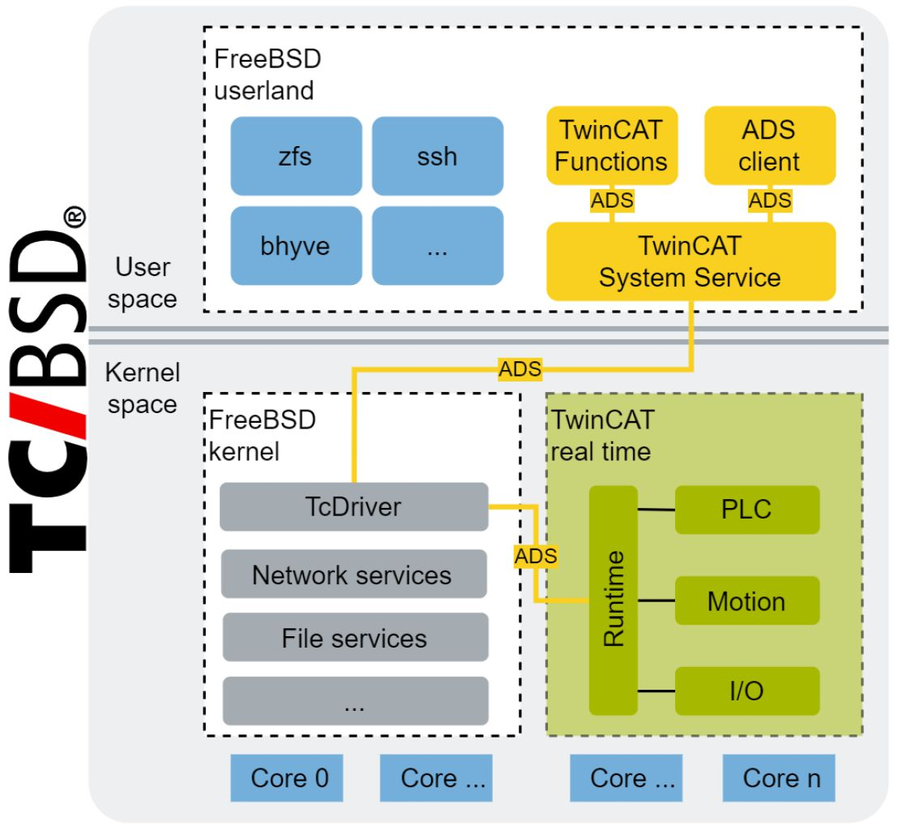

# GPU 直通

作者：Corvin Köhne 和 Daniel Kerkhoff

译者：冰/deepl

校对：ykla

自 1980 年成立以来，Beckhoff【倍福自动化公司是主要在德国费尔的自动化公司。倍福自动化公司主要是实现工业自动化以及楼宇自动化的控制系统。倍福是实时以太网 EtherCAT 的发起者。——引自维基百科。校对者注，下同】 一直致力于工业自动化技术的研究。在 1986 年，基于 PC 的机器控制概念诞生了。那时，Beckhoff 正在摒弃基于微控制器的 PLC，并开始使用标准 PC 技术作为 PLC 的基础，同时将使用在工业外壳中【即一种特殊设计的外部保护壳，用于包裹、保护和隔离工业设备或机器。】。这极大地提高了性能，因为 PC 已经比微控制器强大得多。

随着 Windows 的兴起，使通用操作系统成为机器控制系统本身的一部分的想法诞生了。Windows 环境已为机器制造商和操作员所熟悉。Windows 环境还可以用额外的用户应用程序来扩展，这被证明是有益的，因为它为整个控制系统提升了价值。然而，Windows 本身并不能为具有硬性、实时约束的控制逻辑提供所需的执行环境。

TwinCAT（代表 Windows 控制自动化技术）软件已被开发出来，并在 1996 年首次发布。TwinCAT 被设计为 Windows NT 的扩展，以确保在 Beckhoff （开发的）基于 Windows 的控制系统上确定地执行控制任务。

多年来，PC 的硬件组件，如 CPU、内存、总线系统和 I/O 设备变得更加强大，基于 PC 的控制系统也一样。2002 年，Beckhoff 发明了嵌入式 PC 系列，这是一种可安装在 DIN 导轨上的工业 PC，可直接连接到 Beckhoff I/O 系统。由于这些设备使用了低功耗的 CPU（AMD SC2200）和小巧的闪存卡，因此需要一个迷你的嵌入式操作系统。当时，Windows CE 是市场上的主导者，是这种嵌入式 PC 系列的明显选择。今天，Beckhoff 提供了一个广泛的工业 PC 产品系列，从小型单核 ARM CPU 到最新的 AMD Ryzen CPU 和基于英特尔至强的服务器级设备。因此，控制系统工程师可以为其应用选择合适的性能等级。

TwinCAT 运行时是所有 Beckhoff 工控机的共同标准，自然，TwinCAT 本身也随着时间的推移不断发展，使控制系统能够利用现代 PC 硬件的力量。Windows 已经成为 Beckhoff 及其客户基于 PC 的控制系统的标准操作系统。

然而，近年来，Windows CE 已经过时，客户对基于非 Windows 的控制系统的需求也在增加，因此 Beckhoff 开始寻找一种可以成为新的 TwinCAT 主机的替代操作系统。最终，FreeBSD 被选为承载 TwinCAT 的非 Windows 操作系统。Beckhoff 将 FreeBSD 和 TwinCAT 结合起来，创建了一个新的基于 PC 的控制操作系统，将其命名为 TwinCAT/BSD。

## TwinCAT/BSD

目前，是 TwinCAT/BSD 基 于FreeBSD 13.2。因此，TwinCAT/BSD 受益于 FreeBSD 基本系统，包括 FreeBSD 用户空间程序以及内核服务。此外，Beckhoff 还将 TwinCAT 的大部分功能从基于 Windows 的控制系统中引入到 TwinCAT/BSD 中。TwinCAT/BSD 是由 FreeBSD 基本系统和 TwinCAT 功能组件组成的。

图 1 显示了该系统的结构:



图 1：TwinCAT 在 FreeBSD 上的集成

基于 TwinCAT 的控制系统的核心组件是 TwinCAT 运行时和 TwinCAT 系统服务，包括 ADS 消息路由。TwinCAT 运行时负责执行实时控制任务。实时控制任务通常涉及可编程逻辑控制器（PLC）任务、运动任务（如轴定位或 CNC）以及通过现场总线系统连接的工业 I/O 设备的集成。

为了能够运行具有硬实时要求的控制任务，TwinCAT 配置了不同的系统设置。例如，TwinCAT 使用隔离的 CPU 内核来执行控制任务。隔离的内核被从 FreeBSD 调度器的所有 CPU 组中移除。这使得 TwinCAT 可以充分利用隔离的内核来执行控制任务。TwinCAT 运行时决定了配置的实时任务的执行。每个实时任务都有自己的周期时间，规定了任务执行的频率。

TwinCAT 运行时为自动化设备规范协议（简称 ADS）提供了一个接口，因此 TwinCAT 运行时可以发送和接收 ADS 消息。ADS 是由 Beckhoff 开发的一种应用协议。TwinCAT 系统中的整个信息交换是由 ADS 驱动的。TcDriver 是一个标准的 FreeBSD 内核模块，它在 TwinCAT 运行时和用户空间之间提供了一个 ADS 通道。这个通道被 TwinCAT 系统服务用来控制 TwinCAT 运行时。同样，TwinCAT 系统服务实现了一个 ADS 消息路由，用于在不同的应用程序（如 TwinCAT 运行时和 TwinCAT 功能）之间路由 ADS 消息。由于有了 ADS 消息路由，TwinCAT 系统可以很容易地用其他实现 ADS 协议的服务来扩展。同样，ADS 客户端应用程序只需要访问消息路由器就可以访问 ADS 服务，例如，TwinCAT 运行时可以读写 PLC 任务的数据。ADS 规范和库是公开的，因此基于 ADS 的应用可以很容易实现。

总的来说，为 TwinCAT/BSD 设计的 TwinCAT 架构与基于 Windows 的操作系统的架构相似。然而，Beckhoff 的客户特别青睐 TwinCAT/BSD，因为它是一个更加耦合和强大的操作系统。由于其占用空间小，它经常被用于嵌入式工业 PC 上。这些嵌入式工业 PC 可以在从楼宇自动化、数控机床到自动导引车的控制应用中找到。尽管 TwinCAT/BSD 已经被用于各种控制应用中，但复杂的控制应用总是需要更多的灵活性来扩展控制系统的功能。

## 对虚拟机的需求

对于基于 PC 的控制系统，主机操作系统有两个目的：与任何操作系统一样，它负责为下属的硬件提供一个干净、抽象的接口。同样，操作系统环境可以用来运行应用程序和服务，以扩展控制系统的功能。因此，用户可以为控制系统安装或开发他们自己的应用程序，同时与系统进行交互，就像他们与任何其他 PC 一样。

此外，这些操作系统还可作为 TwinCAT 运行时的主机。FreeBSD 作为一个主机操作系统，负责以适当的方式管理大部分硬件。这使得 TwinCAT 能够专注于调度和执行实时控制任务。然而，如果没有一个正在运行的主机操作系统，TwinCAT 运行时就根本无法运行。就整个控制系统而言，系统操作员在与主机操作系统进行交互时需要非常注意，因为主机操作系统的重新启动或崩溃也会导致实时控制的停止。这对于基于 Windows 和 TwinCAT/BSD 的 PC 控制系统都是如此。

***FreeBSD 作为一个主机操作系统，负责以适当的方式管理大部分的硬件。***

bhyve 提供了一个使用虚拟机作为用户环境的选项，它可以在不影响 TwinCAT 实时系统的情况下重新启动。在这种设置中，TwinCAT/BSD 主机操作系统仍将作为基于 PC 的底层控制系统，但操作员不再直接使用主机操作系统进行人机交互；而是在虚拟机环境中使用客户操作系统。

通过虚拟机，系统设计者可以利用更广泛的操作系统在控制系统上部署额外的服务。一个虚拟化的 Windows 环境可以使 Windows 桌面环境和已经开发的 Windows 用户界面被用于 TwinCAT/BSD 系统的机器交互。诸如此类的环境对那些习惯于基于 Windows 的控制系统的客户特别有用。反过来，一个虚拟化的 Linux 环境将使容器化的 Linux 应用程序能够通过 Docker、Podman 或 Kubernetes 在 IPC 上使用。同样，已经在使用 Linux 容器部署来运行服务或分析过程数据的算法的客户，可以直接在控制系统本身上部署这些应用程序。

bhyve 托管的虚拟机也受益于 OpenZFS，它是 TwinCAT/BSD 上的默认文件系统。对于客户来说，基于 TwinCAT 的控制系统本身和用户应用程序的高可用性是至关重要的。因此，任何可能导致停机或无法操作的系统更新都具有内在的高风险。能够创建显示基本系统和虚拟机磁盘功能状态的 ZFS 数据集快照，就可以恢复系统的功能状态，从而在软件更新出现故障时减少长时间停机的风险。

***所有的网络流量都直接传递到虚拟机环境中，这意味着不需要在 TwinCAT/BSD 主机上应用额外的过滤或路由规则。***

此外，在虚拟机中运行操作系统也可以通过增加可用性来提高系统的安全性。由于数字化，从控制系统中获取过程数据的能力变得更加重要，因为这些数据是优化生产过程的基础。过程数据的获取、处理和解释应尽可能地自动化、过程中和及时。然而，应用程序和/或操作人员需要的对控制系统的访问也增加了控制系统的开放接口可能被利用或错误操作的风险。如果以这种方式访问系统，这反过来会影响控制系统的正确操作，在最坏的情况下，会导致停机，从而导致过程不受控制。在这里，虚拟机可以作为一个额外的网关来限制用户和网络对控制系统的访问。为了通过虚拟机环境提供上述的好处，我们已经开始将 bhyve 纳入 TwinCAT/BSD。

## 虚拟机配置

bhyve 被集成到 TwinCAT/BSD 中，以便配置一个像图 2 所示的系统设置:


图 2：TwinCAT/BSD 上的虚拟机配置样本

在这种设置中，虚拟机的执行应该是可选的，因为并不是每个 TwinCAT/BSD 用户都需要额外的客户系统的单独执行环境。然而，如果需要的话，客户将能够用 bhyve 配置一个虚拟机，该虚拟机可以支持 Windows 或 Linux 客户操作系统的使用情况，或者两者都支持。

Linux 客户操作系统通常需要直接安装在 Linux 客户操作系统上或作为 Linux 容器部署和管理的无头服务器应用。在系统设置方面，这意味着网络接口配置任务，如路由和包过滤，是在主机和客体操作站点上处理。在大多数情况下，这种类型的虚拟机配置包括两个网络接口。其中一个用于纯主机网络，以访问主机操作系统上的 TwinCAT ADS 消息路由。

通过访问 ADS 消息路由，可以收集来自 TwinCAT 控制系统的过程数据。然后，这些数据可以由客户操作系统内的其他服务容器进一步分析。然后，所获得的信息通常通过明确分配给虚拟机的第二个网络接口提供或传输。

在含有现代英特尔或 AMD CPU 的工业 PC 上，为 IO 虚拟化提供了硬件支持。这在英特尔被称为 VT-d，在 AMD 被称为 AMD-Vi。这两种形式的支持都很相似，允许管理程序让客户直接访问硬件设备。设备内存可以被映射到客户内存空间。此外，中断可以被重新映射以直接传递给客户。这允许客户在没有任何管理程序干预的情况下访问一个设备，以提高性能。

bhyve 可支持 VT-d 和 AMD-Vi。

这些都是用于 PCI 直通的。因此，一个 PCI 设备可以被专门分配给一个虚拟机。这个设备不再与主机共享，虚拟机可以直接访问它。

通过 PCI 直通，可以从 TwinCAT/BSD 主机中隔离出来以太网控制器，并明确地分配给虚拟机。因此，所有的网络流量都直接传递给虚拟机环境，这意味着不需要在 TwinCAT/BSD 主机上应用额外的过滤或路由规则。同样，网络流量的处理速度也更快，因为它在客户内部直接可用。

如上所述，带有 Windows 操作系统的虚拟机应作为一个隔离的人机交互环境。因此，工业 PC 的物理 I/O 接口必须被传递到虚拟机中。在 Beckhoff IPC 上，这些接口是 USB 控制器，用于通过键盘、鼠标或触摸面板进行用户输入，当然还有图形控制器，用于在任何连接的显示器上进行视频输出。

像往常一样，PCI 直通被用来将 USB 控制器明确地分配给 Windows 虚拟机。PCI 直通几乎适用于所有的 PCI 设备。然而，显卡是一类 bhyve 不支持 PCI 直通的设备。由于这是一个在管理程序中常见的问题，它通常被称为 GPU 旁路。

## GPU 直通

大多数显卡都有一些特殊的要求，这些要求还没有被 bhyve 处理。这些特殊要求取决于显卡供应商和图形驱动程序。不同的操作系统的图形驱动程序在显卡中需要不同的功能。一些图形驱动程序需要一个 VBIOS，而另一些需要访问特殊的内存区域。
所有这些元素都需要额外的处理，这些都必须为 bhyve 实现。Beckhoff 已经为 bhyve 开发了补丁，以便在 AMD 和集成 Intel 显卡上实现 GPU 直通。我们也正在努力将所有这些补丁上传到上游。

AMD 显卡的 GPU 直通需要 PCI ROM 仿真。在第一步，必须从主机系统中提取显卡的 VBIOS。然后它被客户 BIOS 用来初始化显卡。此外，一些客户图形驱动程序需要 VBIOS。

***可以通过各种不同的方法来提取 VBIOS。目前在 FreeBSD 上还没有提取 VBIOS 的通用方法。***

VBIOS 可以通过各种不同的方法来提取。


目前在 FreeBSD 上还没有提取 VBIOS 的通用方法。因此，必须启动其他的操作系统，如 Linux 来提取 VBIOS。这可以确保为 GPU 直通使用正确的 VBIOS 版本。如果使用不同的版本，可能会出现不兼容的情况，在最坏的情况下可能会损坏你的设备。

VBIOS 被提取出来后，它就得被传递给虚拟机。因此，我们在 bhyve 中添加了一个 PCI ROM 模拟，这样虚拟机就可以读取 PCI ROM 来获得 VBIOS。支持 PCI ROM 仿真所需的补丁已经被上传到上游。PCI ROM 仿真将被包含在 FreeBSD 13.2、14.0 和后续版本中。

不幸的是，支持 PCI ROM 模拟并不足以支持 VBIOS。它必须被执行并被映射到主内存。这应该由虚拟机 BIOS 来完成。然而，bhyve 目前的 edk2 程序不具备这种能力。使之成为可能的补丁已经放在上游，但还没有被接受。因此，必须使用一个修改过的客户 BIOS 来完全支持 AMD 设备的 GPU 直通。


为显卡添加 VBIOS 还提供了另一个好处：VBIOS 包含 UEFI 图形驱动。当客户执行 VBIOS 时，VBIOS 会安装 UEFI 显卡驱动程序。这将被客户的 BIOS 所接收，以产生图形输出。
它使显卡在早期启动阶段可用。由于这个原因，当 VBIOS 被传递给客户时，可以在 UEFI 和引导程序阶段产生图形输出。如果没有 VBIOS，第一次图形输出是在加载操作系统驱动程序之后产生的。

与 AMD 显卡相比，集成英特尔显卡的 GPU 直通还没有被上游接受。英特尔显卡有两个特殊的内存区域，需要特别注意：英特尔称这些内存区域为 OpRegion 和 Graphics Stolen Memory。它们必须由虚拟机 BIOS 保留，并在一个 PCI 寄存器中报告。因此，bhyve 需要检测并向客户报告这些区域。我们对 bhyve 进行了修补，以向虚拟机提供一个 E820 表。它包括所有内存区域，并报告 OpRegion 和 Graphics Stolen Memory 在内存中的位置。我们对虚拟机 BIOS 进行了修改，以解析这个 E820 表并保留该表所报告的所有内存区域。bhyve 的 PCI 仿真通过 PCI 寄存器报告这些内存区域的地址。

我们目前的实现适用于第三代英特尔处理器（Ivy Bridge）到第九代英特尔处理器（Coffee Lake Refresh）。较新的英特尔处理器需要稍作修改才能进行仿真。支持将在未来添加。我们还没有在各种不同的显卡上测试 AMD 显卡的 GPU 直通功能。根据一些测试过补丁的 bhyve 用户的反馈，它被支持在各种不同的 AMD 显卡上。

如前所述，GPU 直通与 PCI 直通是一样的。bhyve 的 `-s` 参数可以用于 GPU 直通，如以下代码块所示：

```
bhyve \
−s 0,hostbridge \
−s 2,passthru,0/2/0 \
−s 31,lpc \
−l bootrom,/usr/local/share/uefi−firmware/BHYVE_UEFI.fd \ my−vm
```

如果你想把 VBIOS 传给虚拟机，我们在 bhyve 的 `-s` 参数中增加了一个 ROM 选项：

```
−s 2,passthru,0/2/0,rom=/home/user/vbios.rom
```

## 结论

FreeBSD 与 Beckhoff TwinCAT 自动化软件的结合，构成了 TwinCAT/BSD 操作系统的基石。TwinCAT/BSD 是 Beckhoff 基于 Windows 的控制系统的 Unix 替代方案，已经被用于各种控制系统中。

现在，通过将 bhyve 集成到 TwinCAT/BSD 中，基于 PC 的控制系统可以从虚拟机环境中获益。由于增加了 GPU 直通功能，现在在连接的屏幕可以上可以显示虚拟机的图形输出。这对提供人机界面的应用特别有用。由于这些应用通常来自于以前基于 Windows 的控制系统，现在它们可以在 TwinCAT/BSD 上使用。

虚拟机与 PCI 直通功能相结合，也提供了一种先进的系统设置，其中用户界面和网络接口可以与主机操作系统隔离。因此，虚拟机环境可以提供一个额外的层次来提高控制系统的安全性。

CORVIN KÖHNE 是 Beckhoff 自动化有限公司的一名软件开发人员。他是 Beckhoff 的 FreeBSD 分支的维护者和开发者，该分支被称为 TwinCAT/BSD。他专注于基于 x86 的系统和管理程序技术。由于他对 bhyve 项目的贡献，他在 2022 年成为 FreeBSD 的贡献者。

DANIEL KERKHOFF 的职业生涯开始于 Beckhoff 自动化有限公司的工业自动化解决方案的应用工程师。KG 担任工业自动化解决方案的应用工程师。在获得信息技术的硕士学位后，他加入了 TwinCAT 产品管理团队。他负责处理来自使用 bhyve 和 TwinCAT/BSD 作为 Beckhoff 基于 PC 的控制系统的客户的询问。
